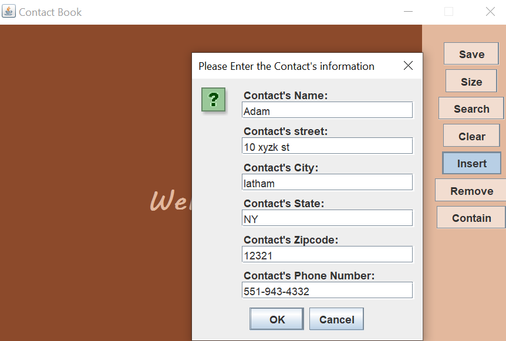

# ContactBook

## Description:

A ContactBook GUI App that holds the operations of a contact book. The GUI was designed using Java Swing and awt. An ADT BinarySearchTree was designed as the back-bone data structure to the ADT ContactBook. Several Operations of the BST were implemented such as insert, remove, search, contains, etc... A Tree Iterator consisting of Inorder, PostOrder, and Preorder options was also designed. The comparator designed in this project compares based on the name's lexicographic values.

## Usage:
You may launch the App simply by importing the given directory and running the 'ContactBook.java' script. A GUI frame should appear with the operations on the right panel and a screen on the left. Below are some of the operations in the Contact Book. There are more avaible than shown below.

  

### Insert:
Adds a new contact to the Contact Book

  

### Size:
Displays the number of contacts in the Contact Book

  

### Search:
Displays the contact information of the given name

  
&nbsp; &nbsp; &nbsp; &nbsp;
  

### Contains:
Displays whether a contact exists in the contact book

  
&nbsp; &nbsp; &nbsp; &nbsp;
  

### Save:
Creates a new txt file, named after the prompt's input, which uses the Tree Iterator's Inorder traversal and saves all the contacts into the txt file.

  
&nbsp; &nbsp; &nbsp; &nbsp;
  

